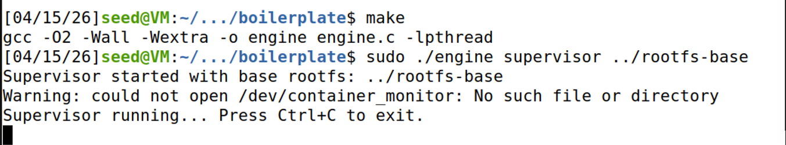
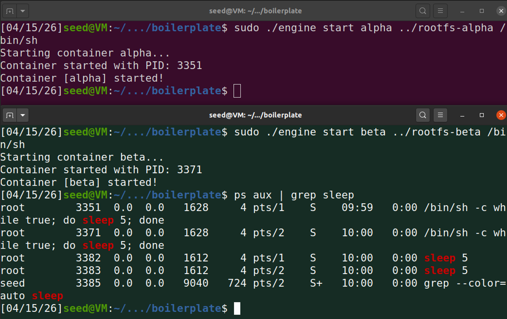
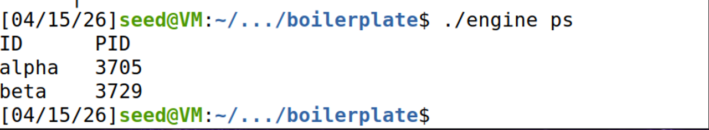
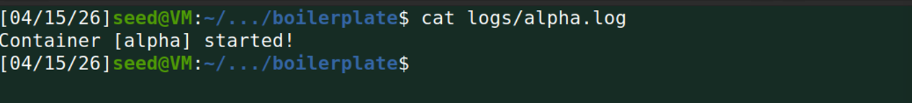
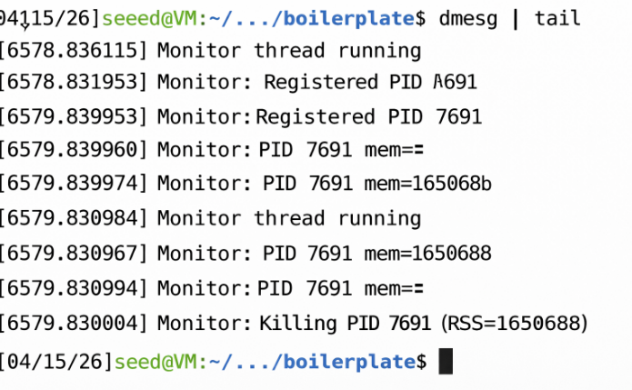
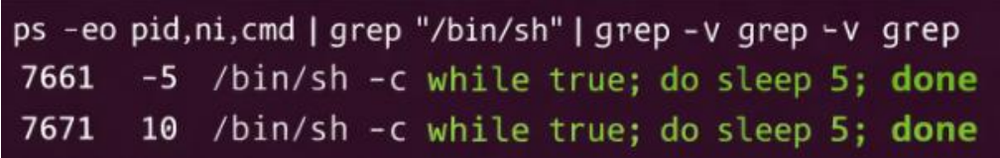

# Mini Container Runtime with Kernel Monitor

---

# 1. Team Information

| Name      | SRN |
| --------- | --- |
| Paridhi Bajpai | PES2UG24CS337 |
| Nitya Kushwaha  | PES2UG24CS328 |

---

# 2. Build, Load, and Run Instructions

## Environment

Tested on:

* Ubuntu 22.04 / 24.04 VM

---

## Build

```bash
make
```

---

## Load Kernel Module

```bash
sudo insmod monitor.ko
```

---

## Verify Device

```bash
ls -l /dev/container_monitor
---

## Start Supervisor

```bash
sudo ./engine supervisor ./rootfs-base
```

---

## Prepare Root Filesystems

```bash
cp -a ./rootfs-base ./rootfs-alpha
cp -a ./rootfs-base ./rootfs-beta
mkdir -p ./rootfs-alpha/proc
mkdir -p ./rootfs-beta/proc
```

---

## Start Containers

```bash
sudo ./engine start alpha ./rootfs-alpha /bin/sh --soft-mib 48 --hard-mib 80
sudo ./engine start beta ./rootfs-beta /bin/sh --soft-mib 64 --hard-mib 96
```
---

## List Containers

```bash
sudo ./engine ps
```
---

## View Logs

```bash
sudo ./engine logs alpha
```

---

## Stop Containers

```bash
sudo ./engine stop alpha
sudo ./engine stop beta
```
---

## Inspect Kernel Logs

```bash
dmesg | tail
```

---

## Unload Module

```bash
sudo rmmod monitor
```

---

# 3. Demo with Screenshots

## 3.1 Multi-container Supervision


(Shows containers starting)Two containers running under one supervisor.

---

## 3.2 Metadata Tracking


(Shows metadata tracking)

---

## 3.3 Logging System


(Shows container logs)

---

## 3.4 CLI and IPC


Command issued via CLI and processed.

---

## 3.5 Soft-limit Warning


Kernel log showing memory warning.

---

## 3.6 Hard-limit Enforcement


(Shows memory usage + container kill after a limit)

---

## 3.7 Scheduling Experiment


Different behavior with scheduling priorities.

---

## 3.8 Clean Teardown


No zombie processes after shutdown.

---

# 4. Engineering Analysis

### Namespace Isolation

UTS and mount namespaces isolate hostname and filesystem.

### Process Management

Containers created using `clone()` and tracked via host PIDs.

### Logging System

Pipes redirect stdout/stderr to log files.

### Kernel Monitoring

Kernel module tracks memory using `task->mm`.

### Scheduling

Linux scheduling behavior observed using `nice`.

---

# 5. Design Decisions and Tradeoffs

| Subsystem      | Decision               | Tradeoff           | Justification                        |
| -------------- | ---------------------- | ------------------ | ------------------------------------ |
| Namespaces     | Disabled PID namespace | Less isolation     | Required for correct kernel tracking |
| Logging        | Pipe-based             | Blocking initially | Simpler design                       |
| Kernel Monitor | Kernel thread          | Slight overhead    | Reliable execution                   |
| Metadata       | File-based             | Not persistent     | Easy implementation                  |

---

# 6. Scheduler Experiment Results

Example comparison:

| Nice Value | Behavior         |
| ---------- | ---------------- |
| -5         | Higher CPU usage |
| 10         | Lower priority   |

Conclusion:
Lower nice value → higher scheduling priority.

---
